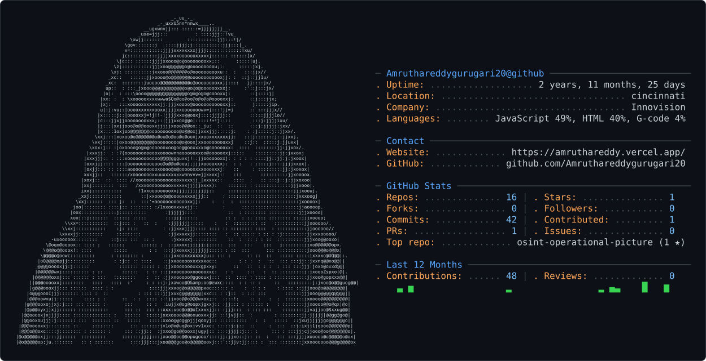

<picture>
  <source media="(prefers-color-scheme: dark)" srcset="dark_mode.svg" />
  <source media="(prefers-color-scheme: light)" srcset="light_mode.svg" />
  
</picture>

### 🚀 Featured builds
- [Derived-Field Check](https://github.com/Amruthareddygurugari20/Derived-Field-Check) — a reference-free checker that catches **80.4%** of silent LLM arithmetic errors (0 of 148 false alarms)
- [AI Client Discovery](https://github.com/Amruthareddygurugari20/Ai-client-discovery) — a **5-agent LangGraph** system with verified/inferred guardrails enforced by deterministic code
- [Reproducibility Watchdog](https://github.com/Amruthareddygurugari20/agent-watchdog) — paper + repo → a pinned Dockerfile via a **no-LLM rules gate**
- [MiniClaude](https://github.com/Amruthareddygurugari20/minimal-coding-agent) — a coding agent built **from scratch** with a stdlib AST index; 55 tests
- [OSINT Dashboard](https://github.com/Amruthareddygurugari20/-Live-flights-) — live map of **200+ aircraft** with a Claude analyst layer
- [FitSmart AI](https://github.com/Amruthareddygurugari20/FitsmartAi) — **GPT-4 Vision** food scanner + 5 LangGraph agents

### 🌱 Open source
- [NCAR/i-wrf#107](https://github.com/NCAR/i-wrf/pull/107) — *in review* — verify dependency downloads with **SHA-256 checksums**, hardening the supply chain for NCAR's I-WRF weather-research platform

### 🛠️ Tech I reach for

                     

### 📬 Let's connect

